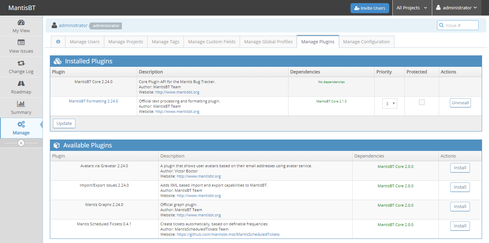
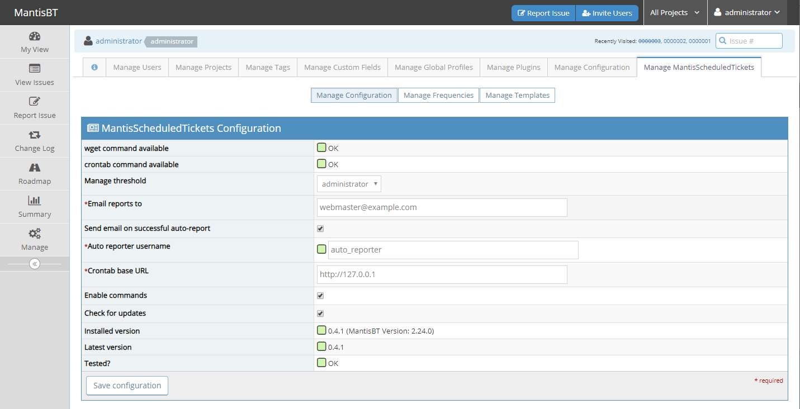
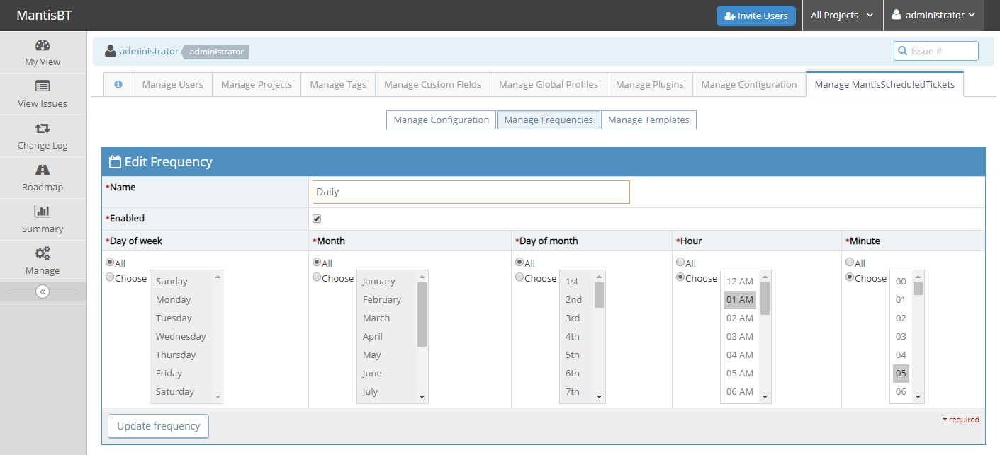
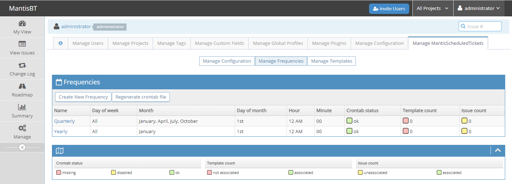
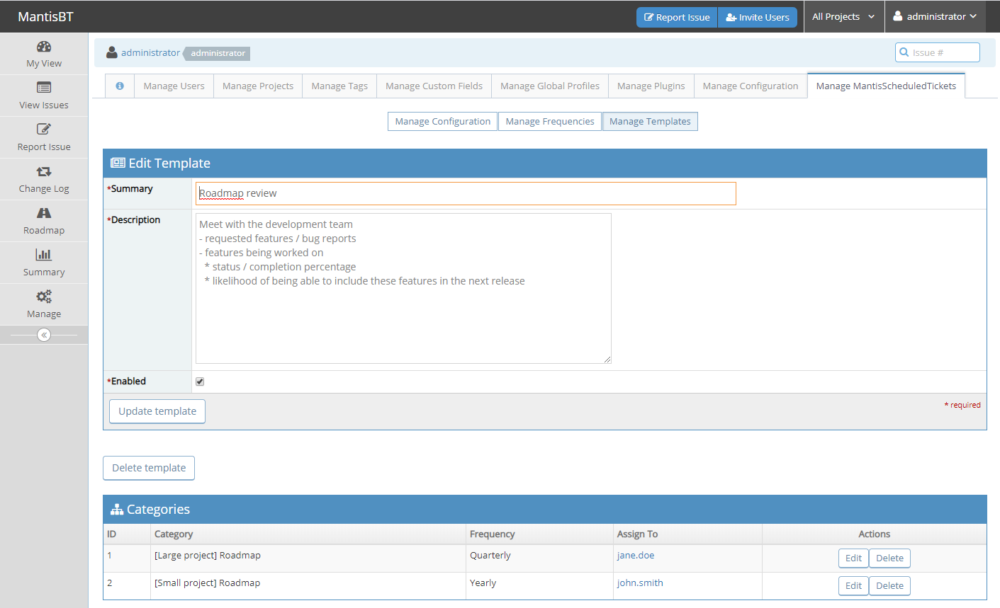
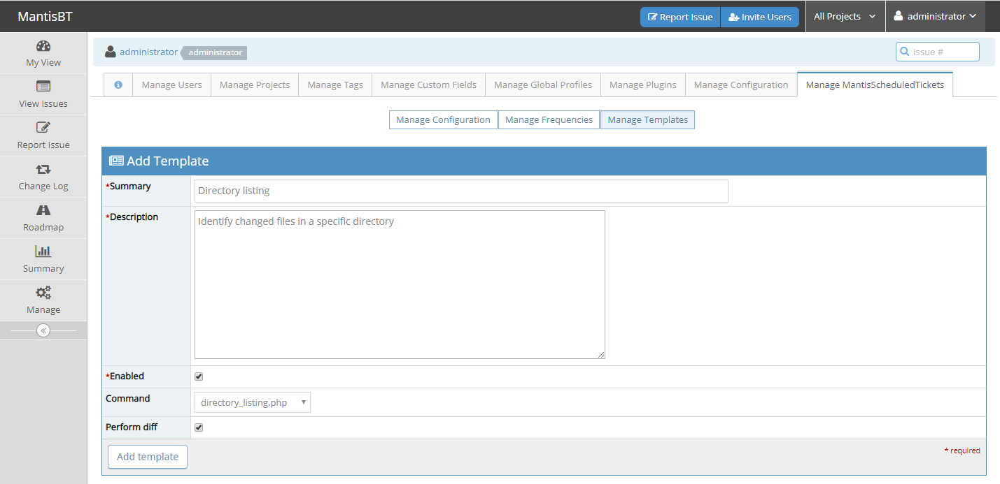
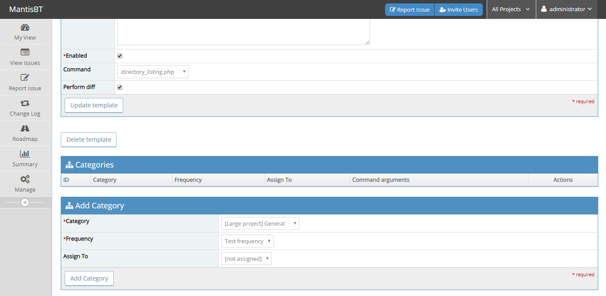
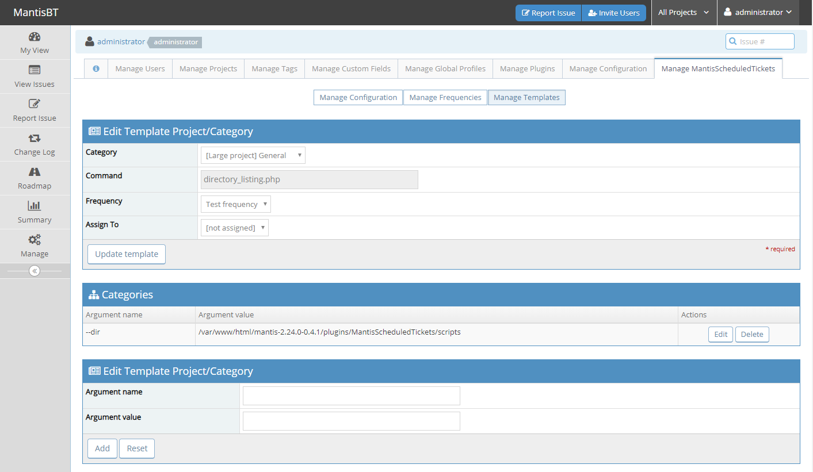
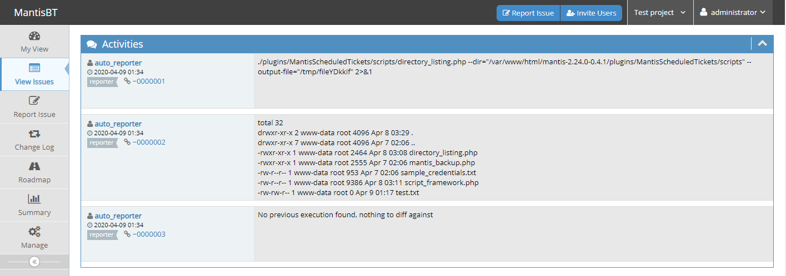
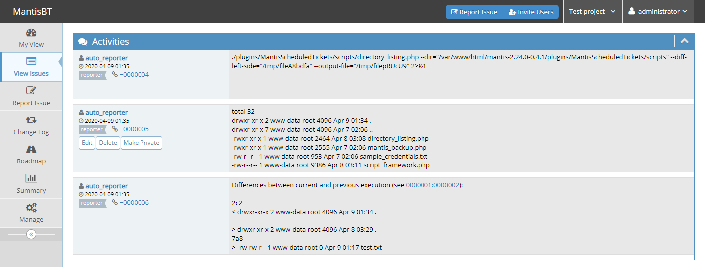

# About

**MantisScheduledTickets** is a Mantis plugin that allows for tickets to be created automatically, based on custom-defined frequencies and templates.

You first define "frequencies" that make sense for you and your specific context/scenario. Next, you define ticket "templates" and associate them with projects/categories, as well as frequencies. All you have to do now is sit back and wait... Tickets should now be generated automatically, based on the frequencies that you defined. As an added bonus, you can even have these tickets assigned to a particular user!

# Installation Instructions

Installing **MantisScheduledTickets** is as simple as installing any other Mantis plugin:
1. Download the [latest version](https://github.com/mantisbt-mst/MantisScheduledTickets/releases) of **MantisScheduledTickets**.
2. Extract the zip file in a temporary location.
3. Copy the `MantisScheduledTickets-0.4.1` directory into your Mantis installation's `plugins` directory and rename it to `MantisScheduledTickets`
4. Log into Mantis with an account that has sufficient privileges to manage plugins.
5. Click the `Install` link next to MantisScheduledTickets.



# User's Guide

**MantisScheduledTickets** currently only supports scheduling tickets via `crontab`, which means that you will only be able to use this functionality if your Mantis server is running on a platform that supports this functionality. Additionally, the `wget` utility must be installed/available.

## Configuration

Before using the plugin, it is recommended that you check the configuration and make the necessary adjustments, if any are needed.



## Define Frequencies

The first step to creating tickets automatically is to define frequencies. A frequency defines when/how often tickets should be created, and is closely related to the `crontab` format:

````
m h dom mon dow
^ ^  ^   ^   ^
| |  |   |   |
| |  |   |   +---  day of week
| |  |   +-------  month
| |  +-----------  day of month
| +--------------  hour
+----------------  minute
````

For instance, if something should trigger daily at 1:05am, that frequency would look like this in `crontab` format:

````
5 1 * * *
````

That same frequency, in **MantisScheduledTickets**, would look like this:



> When defining frequencies, make sure to choose some values for hour and minute. Not doing so will result in a LOT of tickets being generated, more than likely NOT the intended result.

## Define Templates

Having created frequencies, it is now time to create templates. A template simply defines the ticket's summary and description, and allows one to associate projects/categories with frequencies.

For instance, you are managing two software projects. One is a smaller scale project, managed by John Smith, with less frequent releases, while the other, managed by Jane Doe, is more active, with more features being considered and/or actively being worked on. You want to have periodic conversations with the respective development teams to see what features are close to being completed, so that you can develop a roadmap for those projects. You have already defined two frequencies, a quarterly and a yearly:



You now want to have tickets automatically created in the respective projects. You might create a template that looks like this:



Based on the above setup, a ticket should be automatically created every year on January 1st in "Small project"'s Roadmap category, while "Large project" will see 4 tickets being generated automatically, on the 1st of January, April, July and October, respectively.

### Commands

When creating templates, one can also define a command to be executed. As a ticket is created based on this template, the specified command will be executed (in the context of the user that the webserver runs as) and its output will be captured in the resulting ticket.

First, enable commands on the [configuration](#configuration) page.

Next, ensure that the scripts corresponding to the commands you want to use are marked as executable:

````
cd /var/www/html/mantis/plugins/MantisScheduledTickets/scripts
ls -al
chmod +x directory_listing.php
````

Next, define a template, making sure to select an item from the command dropdown:


Add a project/category to this template:


Edit the newly created record and define command arguments, if any are required:


When a ticket is created based on this template, the first comment in the ticket will contain the exact command that will be executed. The second note will contain the output of that command. Finally, if the "Perform diff" checkbox was checked, the third note will contain the output of the diff between the current execution and the previous execution's output.


If a diff is found, the ticket will remain open, otherwise the ticket is closed automatically:



### Scripting

One can create additional commands by implementing a PHP script in the `scripts` directory.

The script should always include the provided scripting framework:

````
#!/usr/bin/php
<?php

require_once 'script_framework.php';
````

Next, it should call the built-in `init_script` function, as in the example below:

````
init_script(
    $argv,
    array(
        '--dir' => array( 'description' => 'List the contents of the specified directory', 'required' => true ),
        '--credentials' => array( 'description' => 'Credentials file', 'required' => false )
    )
);
````

The necessary logic should be implemented next. Finally, the script should populate the `$g_actions` object as needed. The `command_output` SHOULD be populated, along with a number of optional pieces of information (diff, skip_assign etc.).

> If the script in question requires credentials, these should NOT be explicitly specified in the template. Instead, the credentials should be saved to a file (properly secured) and this file should be passed in as an argument to the command.

For additional help, please reach out to us!

## Troubleshooting

If **no** tickets are generated:
- ensure that the frequency is enabled and defined correctly
- check the `crontab` file for an entry that looks like this

````
0 1 * * * wget -q --secure-protocol=auto --no-check-certificate http://127.0.0.1/mantis/plugin.php?page=MantisScheduledTickets/bug_report_auto.php\&frequency_id=1

````

If only **some** tickets are created but not all the tickets you would expect:
- this might be due to the built-in [Mantis anti-spam feature](https://www.mantisbt.org/docs/master/en-US/Admin_Guide/html/admin.config.antispam.html)